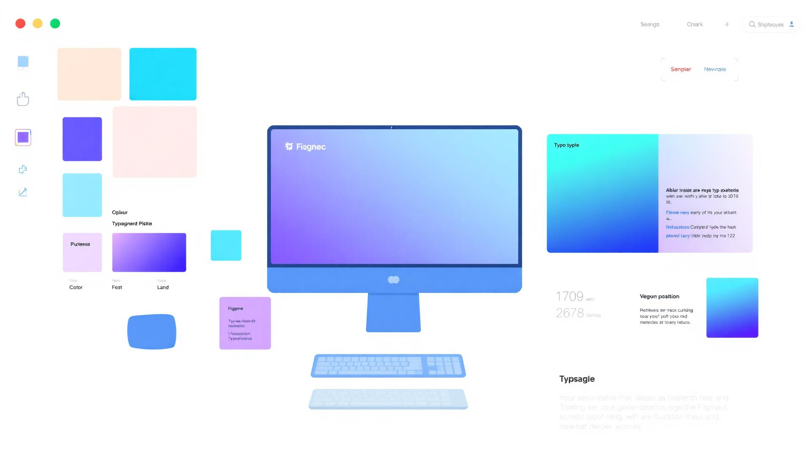

# UI/UX Design Fundamentals



## Design Principles

Understanding the core principles of design: balance, contrast, emphasis, movement, pattern, rhythm, and unity.

### The 7 Principles of Design

1. **Balance** - Distribution of visual weight
2. **Contrast** - Making elements stand out
3. **Emphasis** - Creating focal points
4. **Movement** - Guiding the viewer's eye
5. **Pattern** - Repetition creates consistency
6. **Rhythm** - Visual tempo and flow
7. **Unity** - Cohesiveness of all elements

### Watch: Design Principles Explained

https://www.youtube.com/watch?v=a5KYlHNKQB8

---

## Color Theory

Colors evoke emotions and set the tone for your design. Understanding color theory is essential for creating visually appealing interfaces.

### Color Psychology

| Color | Emotions | Use Cases |
|-------|----------|-----------|
| 🔴 Red | Energy, Passion, Urgency | CTAs, Sales, Alerts |
| 🔵 Blue | Trust, Calm, Professional | Corporate, Finance, Healthcare |
| 🟢 Green | Growth, Health, Success | Eco, Finance, Wellness |
| 🟡 Yellow | Optimism, Warning, Energy | Highlights, Caution |
| 🟣 Purple | Luxury, Creativity, Wisdom | Premium, Beauty, Tech |
| 🟠 Orange | Friendly, Confident, Fun | Entertainment, Food |

### Color Harmony Types

```css
/* Complementary - Opposite on color wheel */
.complementary {
  --primary: #3b82f6;    /* Blue */
  --accent: #f59e0b;     /* Orange */
}

/* Analogous - Adjacent on color wheel */
.analogous {
  --color-1: #3b82f6;    /* Blue */
  --color-2: #8b5cf6;    /* Purple */
  --color-3: #06b6d4;    /* Cyan */
}

/* Triadic - Evenly spaced on color wheel */
.triadic {
  --primary: #3b82f6;    /* Blue */
  --secondary: #f59e0b;  /* Orange */
  --tertiary: #10b981;   /* Green */
}
```

---

## Typography

Typography is the art and technique of arranging type to make written language legible, readable, and appealing.

### Font Pairing Examples

```css
/* Classic Combination */
.classic {
  font-family: 'Playfair Display', serif; /* Headings */
  font-family: 'Source Sans Pro', sans-serif; /* Body */
}

/* Modern Combination */
.modern {
  font-family: 'Montserrat', sans-serif; /* Headings */
  font-family: 'Open Sans', sans-serif; /* Body */
}

/* Elegant Combination */
.elegant {
  font-family: 'Cormorant Garamond', serif; /* Headings */
  font-family: 'Raleway', sans-serif; /* Body */
}
```

### Typography Scale

```css
:root {
  /* Type scale - Perfect Fourth (1.333) */
  --text-xs: 0.75rem;      /* 12px */
  --text-sm: 0.875rem;     /* 14px */
  --text-base: 1rem;       /* 16px */
  --text-lg: 1.125rem;     /* 18px */
  --text-xl: 1.333rem;     /* 21px */
  --text-2xl: 1.777rem;    /* 28px */
  --text-3xl: 2.369rem;    /* 38px */
  --text-4xl: 3.157rem;    /* 50px */
  --text-5xl: 4.209rem;    /* 67px */
}
```

### Best Practices
- ✅ Use maximum 2-3 font families
- ✅ Maintain clear hierarchy (size, weight, spacing)
- ✅ Ensure sufficient contrast (4.5:1 for body text)
- ✅ Use appropriate line height (1.5-1.6 for body)
- ✅ Limit line length (45-75 characters)
- ❌ Don't use too many font weights
- ❌ Avoid using Comic Sans or Papyrus

---

## User Experience (UX) Basics

UX design focuses on creating meaningful and relevant experiences for users.

### The UX Design Process

1. **Research** - Understand users and their needs
2. **Define** - Identify problems and opportunities
3. **Ideate** - Brainstorm solutions
4. **Prototype** - Create interactive mockups
5. **Test** - Validate with real users
6. **Iterate** - Refine based on feedback

### User Research Methods

- **Interviews** - One-on-one conversations
- **Surveys** - Quantitative data collection
- **Usability Testing** - Observe users completing tasks
- **Card Sorting** - Understand mental models
- **A/B Testing** - Compare design variations
- **Analytics** - Track user behavior

### Creating User Personas

```markdown
## Persona: Sarah - The Busy Professional

**Demographics**
- Age: 32
- Location: New York City
- Occupation: Marketing Manager
- Tech Savviness: High

**Goals**
- Find information quickly
- Complete tasks efficiently
- Learn new skills during commute

**Frustrations**
- Cluttered interfaces
- Slow loading times
- Unclear navigation

**Behaviors**
- Uses mobile 70% of the time
- Prefers video content
- Skims rather than reads
```

---

## UI Design Principles

### Visual Hierarchy

Create a clear order of importance through:
- **Size** - Larger elements draw attention
- **Color** - High contrast creates focus
- **Position** - Top and center are noticed first
- **Whitespace** - Spacing creates emphasis

### The F-Pattern and Z-Pattern

**F-Pattern** (Content-heavy pages)
- Users scan horizontally at the top
- Move down, scan second horizontal line
- Continue scanning left side vertically

**Z-Pattern** (Simple pages)
- Eyes start top-left
- Move horizontally to top-right
- Diagonal to bottom-left
- Horizontal to bottom-right

### Gestalt Principles

```
Proximity: Elements close together are perceived as related
Similarity: Similar elements are perceived as a group
Continuity: Eyes follow continuous lines naturally
Closure: Mind completes incomplete shapes
Figure-Ground: Mind separates objects from background
```

---

## Accessibility (A11y)

Making designs usable for everyone, including people with disabilities.

### WCAG Principles

1. **Perceivable** - Information must be presentable to all users
2. **Operable** - Interface must be navigable by all
3. **Understandable** - Information must be clear
4. **Robust** - Compatible with assistive technologies

### Accessibility Checklist

- ✅ Color contrast ratio minimum 4.5:1
- ✅ All images have alt text
- ✅ Keyboard navigation works
- ✅ Form labels are clear
- ✅ Focus states are visible
- ✅ Text can be resized to 200%
- ✅ No flashing content (seizure risk)
- ✅ Semantic HTML structure

```html
<!-- Good accessibility example -->
<button 
  aria-label="Close dialog"
  class="close-button"
>
  <span aria-hidden="true">×</span>
</button>


```

---

## Design Tools

### Popular Design Software

- **Figma** - Collaborative interface design
- **Adobe XD** - UI/UX design and prototyping
- **Sketch** - Mac-only design tool
- **Adobe Illustrator** - Vector graphics
- **Adobe Photoshop** - Image editing

### Design Resources

- [Dribbble](https://dribbble.com) - Design inspiration
- [Behance](https://behance.net) - Creative portfolios
- [Awwwards](https://awwwards.com) - Web design awards
- [UI Movement](https://uimovement.com) - UI inspiration
